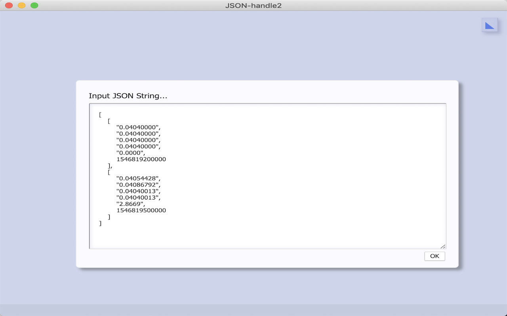
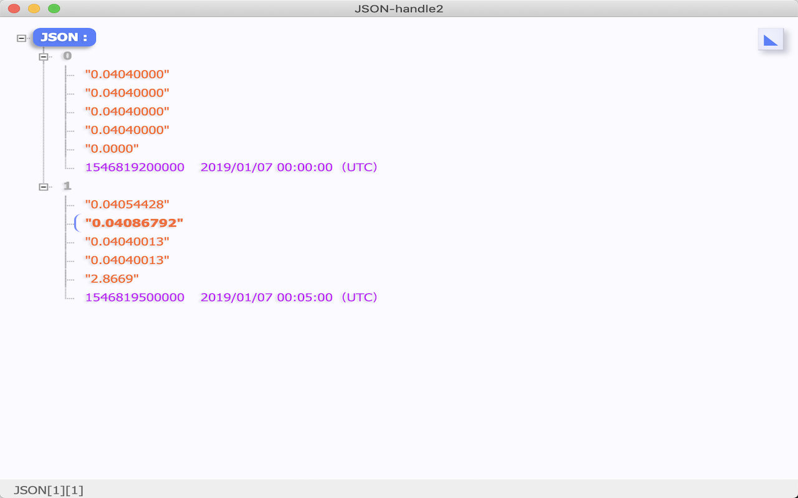

# JSON-handle2
Chrome plugin to parse JSON.

## The difference with JSON-handle

## Install
To Install [on Chrome](https://chrome.google.com/webstore/detail/JSON-handle2/iahnhfdhidomcpggpaimmmahffihkfnj), [on Firefox](https://addons.mozilla.org/en-US/firefox/addon/JSON-handle2/).

## Home Page

JSON-handle2 Home Page：  [jsonhandle.sinaapp.com](http://jsonhandle.sinaapp.com/)

Question of this repository:  [new issues](https://github.com/wilon/JSON-handle2/issues/new)

------
### Statement
I'm not the original author. I just wanted to use a copy button to make it easy to use. I found that the author didn't put GitHub repository before creating the project. The code came from Chrome plug-in.
